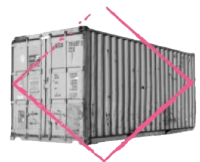

# Publisher - HackMyVM - Easy

**Schwierigkeitsgrad:** Easy 🟢

---

## ℹ️ Maschineninformationen

*   **Plattform:** HackMyVM
*   **VM Link:** [https://hackmyvm.eu/machines/machine.php?vm=Publisher](https://hackmyvm.eu/machines/machine.php?vm=Publisher)
*   **Autor:** DarkSpirit

---

## 🏁 Übersicht

Dieser Bericht dokumentiert den Penetrationstest der virtuellen Maschine "Publisher" von HackMyVM. Ziel war die Erlangung von Root-Rechten. Die Maschine wies eine kritische unauthentifizierte Remote Code Execution (RCE) Schwachstelle (CVE-2023-27372) in der veralteten SPIP CMS-Installation auf Port 80 auf, die den initialen Zugriff als Benutzer `www-data` ermöglichte. Die Privilegien-Eskalation zur Erlangung von Root-Rechten erfolgte durch die Ausnutzung einer Fehlkonfiguration in einem SUID-Root-Binary (`/usr/sbin/run_container`), das ein von jedem Benutzer beschreibbares Skript (`/opt/run_container.sh`) ausführte.

---

## 📖 Zusammenfassung des Walkthroughs

Der Pentest gliederte sich in folgende Hauptphasen:

### 🔎 Reconnaissance

*   Identifizierung der Ziel-IP (192.168.2.38) im lokalen Netzwerk mittels `arp-scan`.
*   Hinzufügen des Hostnamens `publisher.hmv` zur lokalen `/etc/hosts`.
*   Umfassender Portscan (`nmap`), der Port 22 (SSH - OpenSSH 8.2p1) und Port 80 (HTTP - Apache httpd 2.4.41) als offen identifizierte.

### 🌐 Web Enumeration

*   Untersuchung des Apache-Webservers mit `nikto`, der fehlende Sicherheits-Header, ein Informationsleck bezüglich interner IPs (`172.17.0.2`) und Directory Indexing auf `/images/` identifizierte.
*   Manuelle Überprüfung des Quellcodes auf der Hauptseite und Bestätigung der SPIP-Version (4.2.0) sowie Entdeckung einer internen IP in einem Formular-Action-Attribut.
*   Entdeckung und Zugriff auf öffentlich zugängliche Verzeichnisse (`/spip/config/`, `/spip/config/bases/`, `/spip/ecrire/auth/`) aufgrund aktivierten Directory Indexing.
*   Herunterladen der SPIP SQLite-Datenbank (`/spip/config/bases/spip.sqlite`).
*   Analyse der `spip.sqlite` Datenbank und Extraktion des gehashten Passworts (`$2y$...`) für den Benutzer `admin` (Login `admin`, Name `think`).
*   Versuch, den Admin-Passwort-Hash offline mit John the Ripper und rockyou.txt zu knacken.
*   Identifizierung der unauthentifizierten Remote Code Execution (RCE) Schwachstelle CVE-2023-27372 in SPIP 4.2.0.

### 💻 Initialer Zugriff (Shell as www-data)

*   Herunterladen und Vorbereiten eines Proof-of-Concept (PoC) Exploit-Skripts für CVE-2023-27372.
*   Erfolgreicher Test der RCE-Schwachstelle mittels Ausführung des Befehls `sleep 5`.
*   Ausnutzung der RCE-Schwachstelle zur Erlangung einer Reverse Shell als Benutzer `www-data` auf Port 1234 auf dem Angreifersystem.

### 📈 Privilege Escalation

*   Lokale System-Enumeration als `www-data`, einschließlich Suche nach SUID-Binaries.
*   Auffinden des SUID-Root-Binaries `/usr/sbin/run_container`.
*   Analyse von `/usr/sbin/run_container` mittels `strings` und Identifizierung der Ausführung des Skripts `/opt/run_container.sh`.
*   Überprüfung der Berechtigungen von `/opt/run_container.sh`, die Schreibrechte für alle Benutzer (`777`) aufwiesen.
*   Manipulation des Skripts `/opt/run_container.sh` zum Setzen des SUID-Bits auf `/bin/bash` (`chmod u+s /bin/bash`).
*   Ausführung des SUID-Binaries `/usr/sbin/run_container`, wodurch das manipulierte Skript mit Root-Rechten ausgeführt wird.
*   Erfolgreiches Setzen des SUID-Bits auf `/bin/bash`.
*   Erlangung einer Root-Shell mittels `bash -p`.

### 🚩 Flags

*   **User Flag:** Gefunden in `/home/think/user.txt`
    ` fa229046d44eda6a3598c73ad96f4ca5 `
*   **Root Flag:** Gefunden in `/root/root.txt`
    ` 3a4225cc9e85709adda6ef55d6a4f2ca `

### 🧠 Wichtige Erkenntnisse

*   **Veraltetes CMS:** Kritische Schwachstellen (wie RCE CVE-2023-27372) in veralteten CMS-Versionen sind ein direkter Weg zur Kompromittierung. Regelmäßige Updates sind unerlässlich.
*   **Directory Indexing:** Das Offenlegen von Dateistrukturen und potenziell sensiblen Dateien (wie Datenbanken, Konfigurationen) durch aktivierte Verzeichnisauflistung ist eine schwerwiegende Fehlkonfiguration.
*   **Datenbanksicherheit:** Speichern Sie Datenbankdateien niemals im Web-Root. Schützen Sie Datenbanken mit starken Passwörtern.
*   **SUID-Binary Schwachstellen:** SUID-Binaries, die Skripte mit unsicheren Berechtigungen ausführen, sind ein klassischer und effektiver Privilegien-Eskalationsvektor. Überprüfen Sie Berechtigungen von referenzierten Dateien.
*   **Informationslecks:** Interne IP-Adressen oder detaillierte Fehlermeldungen/Kommentare in öffentlichen Webanwendungen geben Angreifern wertvolle Hinweise.

---

## 📄 Vollständiger Bericht

Eine detaillierte Schritt-für-Schritt-Anleitung, inklusive Befehlsausgaben, Analyse, Bewertung und Empfehlungen für jeden Schritt, finden Sie im vollständigen HTML-Bericht:

[**➡️ Vollständigen Pentest-Bericht hier ansehen**](https://alientec1908.github.io/Publisher_HackMyVM_Easy/)

---

*Berichtsdatum: 11. Juni 2025*
*Pentest durchgeführt von Ben Chehade*
